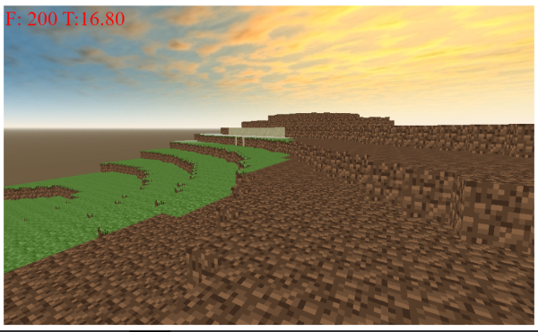
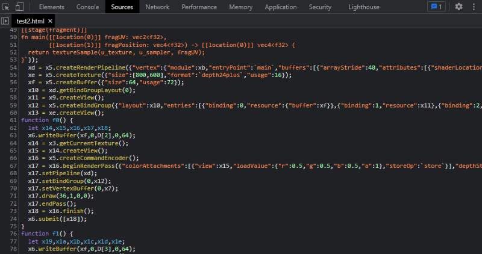

# WebGPU Recorder

**Note** The WebGPU Recorder tool is incorperated into my general WebGPU debugging tool, [WebGPU Inspector](https://github.com/brendan-duncan/webgpu_inspector).

---

WebGPU Recorder is a debugging tool for WebGPU.

It is a playback recorder, designed to capture all WebGPU commands and data, with the ability to play back the commands to recreate the render.

It captures all WebGPU commands, buffers, and textures, over a given number of frames. It will then generate an HTML file containing javascript with all of the WebGPU commands recorded. This generated HTML file can be opened in the browser to play back the recording.

This can be used to diagnose issues with WebGPU rendering by eliminating everything but the raw WebGPU commands. This is also very helpful for submitting self-contained reproduction examples for bug reports.

## Usage

### Loading and Starting the WebGPU Recorder

The WebGPU Recorder script is an ES6 module and can be loaded via

```html
<script id="webgpu_recorder" type="module">
    import {WebGPURecorder} from "webgpu_recorder.js";
    new WebGPURecorder(); // Create and start the WebGPU Recorder
</script>
````

### From NPM

webgpu_recorder can be loaded via NPM

```
npm install webgpu_recorder
```

Then you can import the module from
```javascript
import {WebGPURecorder} from "webgpu_recorder/webgpu_recorder.js";
new WebGPURecorder(); // Create and start the WebGPU Recorder
```

### From CDN

The webgpu_recorder.js script can be loaded from a CDN so you don't have to store it locally and make sure you're always using the latest version of the recorder.

```html
<script id="webgpu_recorder" type="module">
    import {WebGPURecorder} from "https://cdn.jsdelivr.net/gh/brendan-duncan/webgpu_recorder/webgpu_recorder.js";
    new WebGPURecorder(); // Create and start the WebGPU Recorder
</script>
````

### Starting The Recorder

The **WebGPURecorder** class will start the recorder with the options provided to the constructor.

Because the recorder needs to record all commands and data, it starts recording as soon as it is constructed, and will continue recording for the maximum number of frames. **The recorder should be created before any rendering code starts so it has a chance to wrap WebGPU.**

The recording will download automatically as an HTML file with embedded Javascript after the maximum number of frames have been recorded or when `generateOutput` is called (see [example](test/test3.html)).

You can optionally configure the recorder

```javascript
new WebGPURecorder({
    "frames": 100,
    "export": "WebGPURecord",
    "removeUnusedResources": false,
    "download": true
});
```

Where

* **frames**: the maximum number of frames to record.
* **export**: the name of the generated HTML file, as ${export}.html
* **removeUnusedResources**: if true, resource commands not needed for rendering are removed, otherwise all commands are recorded.
* **download**: if true, the html will be downloaded.
* **recordMode**: how the recorder captures frames (default `0`):
    * `0` — record every command from the first frame through `frames` frames.
    * `1` — record only the last of `frames` frames.
    * `2` — **stateful arbitrary-frame capture** (see below).
* **output**: the output format (default `"html"`):
    * `"html"` — the self-contained, openable HTML file (data embedded as base64).
    * `"binary"` — an efficient `.wgpu` file (raw data, no base64) for use with the player (see
      [Binary Recordings and the Player](#binary-recordings-and-the-player)).
    * `"both"` — produce both an `.html` and a `.wgpu`.

## Recording an Arbitrary Frame (recordMode 2)

`recordMode: 2` lets you capture a single, arbitrary frame at any point in a long-running
application — for example frame 500 of a game — without recording everything from the start.

Instead of logging every command from frame 0, the recorder maintains a live model of all GPU
objects: how each was created and which other objects it depends on. Objects are tracked across
their whole lifetime, and freed from the recorder's cache when they are destroyed (explicitly via
`destroy()` or through garbage collection), so memory stays bounded during long sessions. An
object is only freed once nothing still alive depends on it.

When the target frame is reached, the recorder reads back the current contents of every live
buffer and texture directly off the GPU and turns them into `writeBuffer`/`writeTexture` commands
in the recording's initialize block. This captures the correct state regardless of how it was
produced — whether by host writes (`writeBuffer`/`writeTexture`/mapped writes) in earlier frames,
or by GPU compute/render passes. Only the objects (and data) actually used by the captured frame
are included; everything else is discarded.

```javascript
new WebGPURecorder({
    "recordMode": 2,
    "recordFrame": 500,    // capture frame 500 (rAF count from page load); omit to trigger later
    "continuous": false,   // if true, keep tracking so further triggers can capture again
    "export": "WebGPURecord"
});
```

* **recordFrame**: the absolute frame index (count of `requestAnimationFrame` callbacks since page
  load) to capture. May also be an **array** of indices to capture several frames in one session,
  e.g. `"recordFrame": [8, 20, 500]`. When more than one frame is captured, each downloaded file is
  suffixed with its frame number (`${export}_8.html`, `${export}_20.html`, ...). Recording stops
  after the last listed frame (unless `continuous` is `true`). If omitted, the recorder tracks state
  and waits for a runtime trigger.
* **continuous**: if `true`, the recorder keeps tracking state after a capture so it can capture
  again later in the same session. If `false` (default), recording stops after the last captured
  frame.

### Triggering a capture at runtime

In addition to `recordFrame`, a capture can be requested at runtime three ways:

```javascript
// 1. From code / the console, via the exported recorder instance:
__webgpuRecorder.recordNextFrame();      // capture whichever frame comes next
__webgpuRecorder.recordFrame(500);       // capture an absolute frame index
__webgpuRecorder.recordFrame([8, 20]);   // queue several frames to capture

// 2. By dispatching an event (from the page or an extension):
window.dispatchEvent(new CustomEvent("__WebGPURecorder", { detail: {
    action: "webgpu_recorder_record_frame",
    frame: 500   // omit "frame" to capture the next frame
} }));
```

From a worker, post the same `{ action: "webgpu_recorder_record_frame", frame }` message to the
worker.

### Limitations of arbitrary-frame capture

* Resources whose contents cannot be read back are skipped (with a console warning) and will be
  uninitialized in the recording: multisampled textures, depth/stencil textures, formats that
  cannot be copied to a buffer, and `MAP_READ` staging buffers.
* Non-mappable buffers have `COPY_SRC` added to their usage automatically so they can be read back.
* Render bundles and objects created *during* the captured frame are not added to the live state
  model for subsequent `continuous` captures.

## Binary Recordings and the Player

With `output: "binary"` (or `"both"`) the recorder produces a compact `.wgpu` file instead of HTML.
The commands are stored as a small JSON header and all buffer/texture data is stored as **raw
bytes** (no base64 inflation, no JavaScript-source overhead), so binary recordings are considerably
smaller than the equivalent HTML.

`webgpu_player.js` loads a `.wgpu` and replays it by interpreting the command stream against a live
WebGPU device, with an API to control execution and inspect commands:

```javascript
import { WebGPUPlayer } from "webgpu_player.js";

const buffer = await (await fetch("WebGPURecord.wgpu")).arrayBuffer();
const player = new WebGPUPlayer(buffer);
await player.load(canvas);          // create the device and run the recording's setup once

await player.executeAll();          // replay the whole recording

// Replay up to a specific frame command. If it is inside a render/compute pass or an unfinished
// command encoder, the player ends the pass, finishes the encoder, and submits, so the partial
// frame is presented.
await player.executeToCommand(42);

// Play all frames as an animation (advance state frame-by-frame, like the generated HTML):
await player.resetForPlayback();
for (let f = 0; f < player.getFrameCount(); ++f) {
    await player.renderFrame(f);          // drive one per requestAnimationFrame in a real loop
}

// Inspect commands and the data they reference (no GPU work):
player.getCommandCount();           // number of frame commands
player.getCommandInfo(42);          // { frame, indexInFrame, object, method, result, async, args, dataIndices }
player.getCommandData(42);          // [{ index, type, data: TypedArray }, ...] (e.g. the bytes a writeBuffer uploads)
player.getData(dataIndex);          // the TypedArray for a data blob
player.getInitCommandCount();       // setup (initialize) commands
player.getInitCommandInfo(i);
```

The player exposes the **recorded** command descriptors and data; it does not read back live GPU
resource contents. See `test/test_binary.html` for producing a `.wgpu`, `test/play_all.html` for
loading one and playing all frames as a looping animation, and `test/player.html` for a stepping UI
(play, step, execute-to-command, dump command info).

## Recording From a Web Worker

Recording from a web worker rendering to an offscreen canvas requires a little more work, due to restrictions of web workers.

When WebGPURecorder is run from a worker thread, instead of downloading the generated html, it will post a message back to the main thread with the data. The main thread can listen to the worker messages, and when it recieves the "webgpu_record_data" message, it can call the "webgpu_recorder_download_data" function to trigger the browser to download the generated html file.

#### Worker.html

```html
<script type="module">
    import { webgpu_recorder_download_data } from "webgpu_recorder.js";
    const worker = new Worker(new URL('./worker.js', import.meta.url), { type: 'module' });
    worker.addEventListener('message', (ev) => {
        switch (ev.data.type) {
            case "webgpu_record_data":
                webgpu_recorder_download_data(ev.data.data, ev.data.filename);
                break;
        }
    });
    // ...
</script>
```

#### Worker.js

```html
import {WebGPURecorder} from "webgpu_recorder.js";
async function run(canvas) {
    new WebGPURecorder({
        "frames": 10,
        "export": "WebGPURecord"});
    // ...
}
```

## Play The Recording

The recording is a self-contained HTML file so you don't need a local server to view it.

Open the downloaded HTML file in a WebGPU capable browser to play back the recording.

***
*A recording from a WebGPU game:*




***

### Notes

It is necessary to start the recorder prior to rendering so that all WebGPU objects are correctly recorded.

It is best suited for small tests, as the recorded data can get quite large.

All buffer and texture data is stored in the recording. The recording stores the data in base64 format to reduce file size, but it can still make the recording files large.

External textures in WebGPU can't be captured. _copyExternalImageToTexture_ will get converted to _writeTexture_ in the recording, with the external image data getting converted to raw data.

External video textures can't currently be recorded.

## Binary Recording Format (`.wgpu`)

A `.wgpu` file (produced with `output: "binary"` / `"both"`) is a small JSON header describing the
command stream followed by a raw data section holding all buffer/texture bytes. All multi-byte
integers are **little-endian**.

### Container layout

| Offset | Size | Field | Description |
| --- | --- | --- | --- |
| 0 | 4 | `magic` | The ASCII bytes `"WGPR"` (`0x57 0x47 0x50 0x52`). |
| 4 | 4 | `version` | `uint32`. Format version (currently `1`). |
| 8 | 4 | `headerByteLength` | `uint32`. Byte length of the header JSON. |
| 12 | `headerByteLength` | `header` | UTF-8 encoded JSON (see below). |
| 12 + `headerByteLength` | rest of file | `dataSection` | Raw, concatenated buffer/texture bytes. |

### Header JSON

```jsonc
{
  "version": 1,
  "canvasWidth": 800,
  "canvasHeight": 600,
  "gpuVar": "x",            // variable name bound to navigator.gpu
  "contextVar": "context",  // variable name bound to the canvas WebGPU context
  "init":   [ <command>, ... ],       // setup commands, run once
  "frames": [ [ <command>, ... ], ... ], // per-frame command lists
  "data":   [ <dataEntry>, ... ]      // indexed by data-blob index
}
```

* **`gpuVar` / `contextVar`** — the player pre-binds these variable names to `navigator.gpu` and
  the live `canvas.getContext("webgpu")` before replaying.
* **`init`** — commands that create persistent resources (adapter/device/pipelines/buffers/…) and
  upload their data. A player runs these once.
* **`frames`** — one command list per recorded frame. For a single-frame capture (`recordMode` 1/2)
  there is exactly one list.

### Command object

Each command in `init` / `frames` is:

```jsonc
{
  "object": "xDevice",   // variable name of the receiver object, or null
  "method": "createBuffer",
  "result": "xBuffer",   // variable name to bind the return value to, or "" / omitted
  "args":   "[ {\"size\":64,\"usage\":140} ]", // JSON string (see argument encoding)
  "async":  ""           // "await " if the call is asynchronous, otherwise ""
}
```

`args` is itself a JSON string (parsed by the player). Within it, references are encoded as:

* `{ "__id": "xBuffer" }` — a reference to a previously created object (resolved to the live object
  bound to that variable name).
* `{ "__data": N }` — a reference to data-blob index `N` in the `data` table (resolved to a
  TypedArray over the corresponding bytes in `dataSection`).

All other values are literal JSON (numbers, strings, arrays, descriptor objects). Shader source is
stored as a normal JSON string.

#### Pseudo-methods

Some commands use synthetic method names the player implements specially rather than as direct
WebGPU calls:

| Method | Meaning |
| --- | --- |
| `requestAdapter` / `requestDevice` | Bind the player's once-created adapter/device. `requestDevice`'s `args` are intentionally **not** valid JSON (they reference the generated `requiredFeatures`/`requiredLimits` and are ignored). |
| `__getQueue` | Bind `device.queue` to the result variable. |
| `__setCanvasSize` | `args` are `[width, height]`; resize the canvas. |
| `__writeData` | Write captured bytes into a mapped buffer range. `args` is `[dataIndex]` — a **raw** data-blob index (not a `{ "__data": N }` marker). |
| `__writeTexture` | Equivalent to `queue.writeTexture(...)` (used for the `copyExternalImageToTexture` → `writeTexture` conversion). |

### Data table entry

```jsonc
{ "type": "Float32Array", "length": 64, "offset": 0 }
```

* **`type`** — the TypedArray constructor name (`"Uint8Array"`, `"Uint32Array"`, `"Float32Array"`,
  …). The player reconstructs a TypedArray of this type over the bytes.
* **`length`** — byte length of the blob.
* **`offset`** — byte offset of the blob within `dataSection`.

Unused/purged slots are stored as `{ "type": "", "length": 0, "offset": 0 }` to keep indices stable;
they are never referenced by a `{ "__data": N }`.

`webgpu_player.js` exports `parseWebGPURecording(arrayBuffer)`, which returns
`{ version, header, dataBytes }`, and the `WebGPUPlayer` class that interprets the format.
