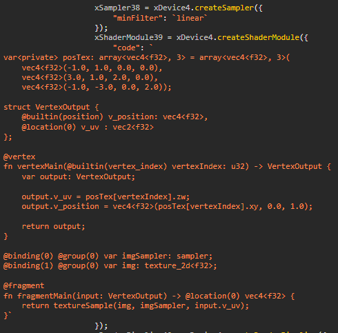

# WebGPU Recorder

WebGPU Recorder is a debugging tool for WebGPU.

It is a playback recorder, designed to capture all WebGPU commands and data, with the ability to play back the commands to recreate the render.

It captures all WebGPU commands, buffers, and textures, over a given number of frames. It will then generate an HTML file containing javascript with all of the WebGPU commands recorded. This generated HTML file can be opened in the browser to play back the recording.

This can be used to diagnose issues with WebGPU rendering by eliminating everything but the raw WebGPU commands. This is also very helpful for submitting self-contained reproduction examples for bug reports.

## Usage

### Load From CDN

You can load the script through a CDN so you don't have to store it locally and make sure you're always using the latest version of the recorder.

```html
<script src="https://cdn.jsdelivr.net/gh/brendan-duncan/webgpu_recorder/webgpu_recorder.js"></script>
````

### Load From Local Script Reference

If you prefer to host your own version, copy the script to your project and load it by adding the following to your project's HTML.

```html
<script src="webgpu_recorder.js"></script>
````

### Start The Recorder

Once the recorder script has been loaded in your app, you can instantiate the recorder by using the following:

```html
<script>
    new WebGPURecorder();
</script>
```

Because the recorder needs to record all commands and data, it starts recording as soon as it is contructed, and will continue recording for the maximum number of frames. **The recorder should be created before any rendering code starts so it has a chance to wrap WebGPU.**

The recording will download automatically as an HTML file with embedded Javascript after the maximum number of frames have been recorded.

You can optionally configure the recorder

```html
<script>
    new WebGPURecorder({
        "frames": 100,
        "export": "WebGPURecord",
        "width": 800,
        "height": 600
    });
</script>
```

Where

* **frames** is the maximum number of frames to record.
* **export** is the basename of the generated HTML file.
* **width** is the width of the canvas in the recording. This should match the width of the original canvas.
* **height** is the height of the canvas in the recording. This should match the height of the original canvas.

## Play The Recording

The recording is a self-contained HTML file so you don't need a local server to view it.

Open the downloaded HTML file in a WebGPU capable browser to play back the recording.

***
*A recording from a WebGPU game:*




***

### Notes

It is necessary to start the recorder prior to rendering so that all WebGPU objects are correctly recorded.

All buffer and texture data is stored in the recording. The recording stores the data in base64 format to reduce file size, but it can still make the recording files large.

External textures in WebGPU can't be captured. _copyExternalImageToTexture_ will get converted to _writeTexture_ in the recording, with the external image data getting converted to raw data.

External video textures can't currently be recorded.
